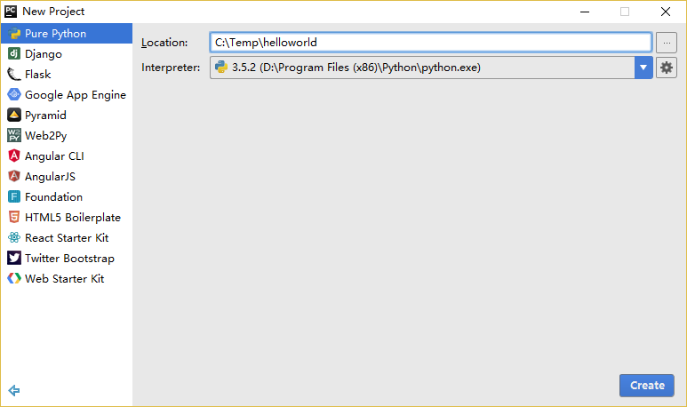
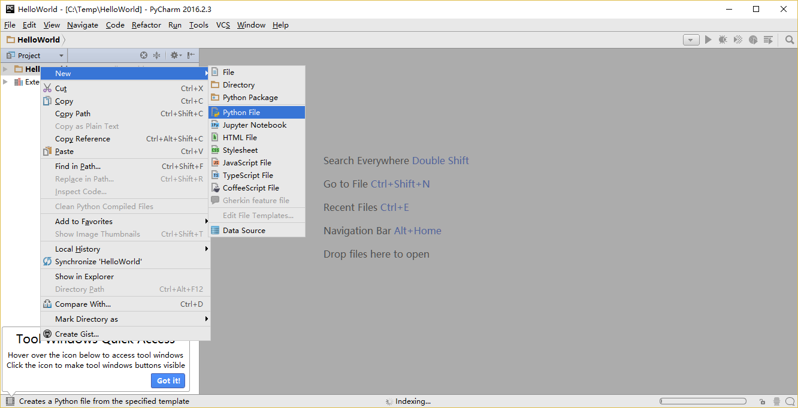
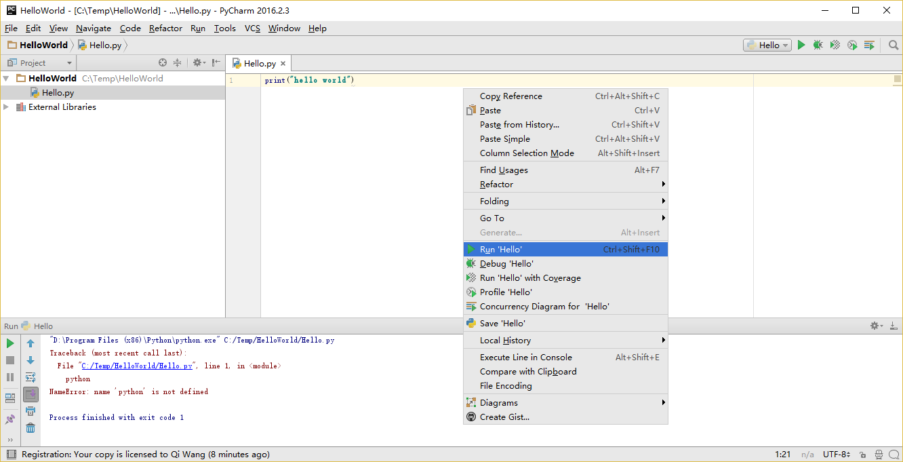

# 第一步

接下來我們將看見如何在 Python 中運行一個傳統的『Hello World』程式。本章將會教你如何編寫、保存與運行 Python 程式。

通過 Python 來運行的你的程式有兩種方法——使用交互式解釋器提示符或直接運行一個源代碼文件。我們將了解如何使用他們二者的功能。

## 使用解釋器提示符

在你的作業系統中打開終端（Terminal）程式（正如我們先前在 [安裝](./installation.md#installation) 章節所討論過的那樣）然後通過輸入 `python3` 並按下 `[enter]` 鍵來打開 Python 提示符（Python Prompt）。

當你啟動 Python 後，你會看見在你能開始輸入內容的地方出現了 `>>>` 。這個被稱作 _Python 解釋器提示符（Python Interpreter Prompt）_ 。

在 Python 解釋器提示符，輸入：

```python
print("Hello World")
```

在輸入完成後按下 `[enter]` 鍵。你將會看到螢幕上列印出 `Hello World` 字樣。

下面是一個在 Mac OS X 電腦上你能夠看見的結果的示例。有關 Python 軟件的細節將會因為你使用的電腦而有所不同，但是從提示符（如 `>>>` ）開始部分應該是相同的，而不會受到作業系統的影響。

<!-- 輸出結果應與 book.json 中的 pythonVersion 變量相同 -->
```python
> python3
Python 3.5.1 (default, Jan 14 2016, 06:54:11)
[GCC 4.2.1 Compatible Apple LLVM 7.0.2 (clang-700.1.81)] on darwin
Type "help", "copyright", "credits" or "license" for more information.
>>> print("Hello World")
Hello World
```

你自然會注意到，Python 會立即給你輸出了一行結果！你剛才所輸入的便是一句獨立的 Python _語句_ 。我們使用 `print` （不必太過驚訝）命令來列印你所提供的資訊。在這里，我們提供了文本 `Hello World` ，然後它便被迅速地列印到了螢幕上。

### 如何退出解釋器提示符

如果你正在使用一款 GNU/Linux 或 OS X 上的 Shell 程式，你可以通過按下 `[ctrl + d]` 組合鍵或是輸入 `exit()` （注意：要記住要包含括弧 `()`）並敲下 `[enter]` 來退出解釋器提示符。

如果你使用的是 Windows 命令提示符，可以按下 `[ctrl + z]` 組合鍵並敲擊 `[enter]` 鍵來退出。

## 選擇一款編輯器

當我們希望運行某些程式時，總不能每次都在解釋器提示符中輸入我們的程式。因此我們需要將它們保存為文件，從而我們便可以多次地運行這些程式。

要想創建我們的 Python 源代碼文件，我們需要在一款能夠為你提供輸入並儲存代碼的編輯器軟件。一款優秀的面向程式員的編輯器能夠幫助你的編寫源代碼文件工作變得輕松得多。故而選擇一款編輯器確實至關重要。你要像挑選你想要購買的汽車一樣挑選你的編輯器。一款優秀的編輯器能夠幫助你更輕松地編寫 Python 程式，使你的編程之旅更加舒適，並助你找到一條更加安全且快速的道路到達你的目的地（實現你的目標）。

對編輯器的一項最基本要求為 _語法高亮_ ，這一功能能夠通過標以不同顏色來幫助你區分 Python 程式中的不同部分，從而能夠讓你更好 _看清_ 你的程式，並使它的運行模式更加形象化。

如果你對應從哪開始還沒有概念，我推薦你使用 [PyCharm 教育版](https://www.jetbrains.com/pycharm-edu/) 軟件，它在 Windows、Mac OS X、GNU/Linux 上都可以運行。在下一節你能夠了解到更多資訊。

如果你正在使用 Windows 系統，**不要用記事本**——這是一個很糟糕的選擇，因為它沒有語法加亮功能，同樣重要的另一個原因是，它不支援文本縮進功能，這一功能我們之後將會了解它究竟有多重要。而一款好的編輯器能夠自動幫你完成這一工作。

如果你已是一名經驗豐富的程式員，那你一定在用 [Vim](http://www.vim.org) 或 [Emacs](http://www.gnu.org/software/emacs/) 了。無需多言，它們都是最強大的編輯器之一，用它們來編寫你的 Python 程式自是受益頗多。我個人用它們來編寫了我大部分程式，同時也因此寫了一本書《[Entire Book on Vim]({{ book.vimBookUrl }})》。

或許你有意去花費時間來學習 Vim 或 Emacs，那麼我自是強烈推薦你學習它們二者中的一款，它們將在長遠意義上對你裨益頗深。當然，正如我先前所推薦的，初學者可以以 PyCharm 開始，從而在此刻專注于學習 Python 而不是編輯器。

再此重申，請選擇一款合適的編輯器——它能夠讓編寫 Python 程式變得更加有趣且容易。

## PyCharm {#pycharm}

[PyCharm 教育版](https://www.jetbrains.com/pycharm-edu/)是一款能夠對你編寫 Python 程式的工作有所幫助的免費編輯器。

當你打開 PyCharm 時，你會看見如下界面，點擊 `Create New Project` ：


選擇 `Pure Python` ：


將你的專案路徑位置中的 `untitled` 更改為 `helloworld` ，你所看到的界面細節應該類似于下方這番：



點擊 `Create` 按鈕。

對側邊欄中的 `helloworld` 右擊選中，並選擇 `New` -> `Python File` ：



你會被要求輸入名字，現在輸入 `hello` ：


現在你便可以看見一個新的文件已為你開啟：


刪除那些已存在的內容，現在由你自己輸入以下代碼：

<!-- TODO: Update screenshots for Python 3 -->

```python
print("hello world")
```
現在右擊你所輸入的內容（無需選中文本），然後點擊 `Run 'hello'` 。



此刻你將會看到你的程式所輸出的內容（它所列印出來的內容）：


謔！雖然只是剛開始的幾個步驟，但從今以後，每當我們要求你創建一個新的文件時，記住只需在 `helloworld` 上右擊並選擇 -> `New` -> `Python File` 並繼續如上所述步驟一般輸入內容並運行即可。

你可以在 [PyCharm Quickstart](https://www.jetbrains.com/pycharm-educational/quickstart/) 頁面找到有關 PyCharm 的更多資訊。

## Vim

1. 安裝 [Vim](http://www.vim.org)。
    * Mac OS X 應該通過 [HomeBrew](http://brew.sh/) 來安裝 `macvim` 包。
    * Windows 用戶應該通過 [Vim 官方網站](http://www.vim.org/download.php) 下載『自安裝可執行文件』。
    * GNU/Linux  用戶應該通過他們使用的發行版的軟件倉庫獲取 Vim。例如 Debian 與 Ubuntu 用戶可以安裝 `vim` 包。
2. 安裝 [jedi-vim](https://github.com/davidhalter/jedi-vim) 插件為 Vim 增添自動完成功能。
3. 安裝與之相應的 `jedi` Python 包：`pip install -U jedi`

## Emacs

1. 安裝 [Emacs 24+](http://www.gnu.org/software/emacs/)。
    * Mac OS X 用戶應該從 http://emacsformacosx.com 獲取 Emacs。
    * Windows 用戶應該從 http://ftp.gnu.org/gnu/emacs/windows/ 獲取 Emacs。
    * GNU/Linux 用戶應該從他們使用的發行版的軟件倉庫獲取 Emacs。如 Debian 和 Ubuntu 用戶可以安裝 `emacs24` 包。
2. 安裝 [ELPY](https://github.com/jorgenschaefer/elpy/wiki)。

## 使用一份源代碼文件

現在讓我們回到編程中來。在你學習一門新的編程語言時有一項傳統，你所編寫並運行的第一個程式應該是 『Hello World』 程式——它所做的全部工作便是宣言你所運行的『Hello World』這句話。正如西蒙·科澤斯（Simon Cozens，一譯西蒙·寇森斯） [^1] 所說，這是『向編程之神所稱頌的傳統咒語，願他幫助並保佑你更好的學習這門語言』。

啟動你所選擇的編輯器，輸入如下程式並將它保存為 `hello.py` 。

如果你正在使用 PyCharm，我們已經討論過[如何從源文件中運行它了](#pycharm)。

對于其他編輯器，打開一個新文件名將其命名為 `hello.py` ，然後輸入如下內容：

```python
print("hello world")
```

你應當將文件保存到哪里？保存到任何你知道其位置與路徑的文件夾。如果你不了解這句話是什麼意思，那就創建一個新文件夾並用這一路徑來保存並運行你所有的 Python 程式：

- Mac OS X 上的 `/tmp/py` 。
- GNU/Linux 上的 `/tmp/py` 。
- Windows 上的 `C:\\py` 。

要想創建上述文件夾（在你正在使用的作業系統上），你可以在終端上使用 `mkdir` 命令，如 `mkdir /tmp/py` 。

重要提示：你需要經常確認並確保你為文件賦予了 `.py` 副檔名，例如 `foo.py` 。

要想運行你的 Python 程式：

1. 打開終端視窗（你可查閱先前的 [安裝](./installation.md#installation)章節來了解應該怎麼做）。
2. 使用 `cd` 命令來**改**變**目**錄到你保存文件的地方，例如 `cd /tmp/py` 。
3. 通過輸入命令 `python hello.py` 來運行程式。程式的輸出結果應如下方所示：

```
$ python hello.py
hello world
```


如果你得到了與上圖類似的輸出結果，那麼恭喜你！——你已經成功運行了你的第一個 Python 程式。你亦已經成功穿過了學習編程的最困難的部分，也就是，開始編寫你的第一個程式！

如果你遭遇了什麼錯誤，請確認是否已經_正確地_上面所列出的內容並重新運行程式。要注意 Python 是區分大小寫的，如 `print` 和 `Print` 是不同的——注意前者的 p 是小寫的，而後者的 P 是大寫的。此外，你需要確保每一行的第一個字符前面都沒有任何空格或制表格——我們會在後面了解 [為什麼這件事如此重要](./07.basics.md#indentation)。

**它是如何工作的**

一款 Python 程式是由 _語句_ 所構成的。在我們的第一個程式中，我們只有一條語句。在這條語句中，我們調用 `print` _語句_ 來搭配我們提供的文本』hello world『。

## 獲取幫助

如果你需要獲得 Python 中有關任何函數或語句的快速資訊，你可以使用其內置的 `help` 功能。這在使用解釋器提示符時十分有用。例如，運行 `help('len')` 命令——這將顯示出有關 `len` 函數的幫助，了解其是用來計算專案數量的。

小貼士：按下 `q` 鍵可以退出幫助。

類似地，你可以通過此方式獲得幾乎所有有關 Python 的資訊。使用 `help()` 命令來了解有關 `help` 它本身的更多資訊吧！

如果你需要獲得有關 `return` 這類運算符的幫助，你需要做的就是將它們放在引號中，就像 `help('return')` 這般，這樣 Python 就不會混淆我們正在試圖做的事情。

## 總結

現在，你應該可以輕松地編寫、保存並運行 Python 程式了。

從此你便成為一名 Python 用戶了，現在讓我們來學習更多有關 Python 的概念。

---

[^1]: 令人印象深刻的《Beginning Perl》一書的作者。——原書注。在本書中，除特別說明的注釋外，其余注釋均為譯者所加。