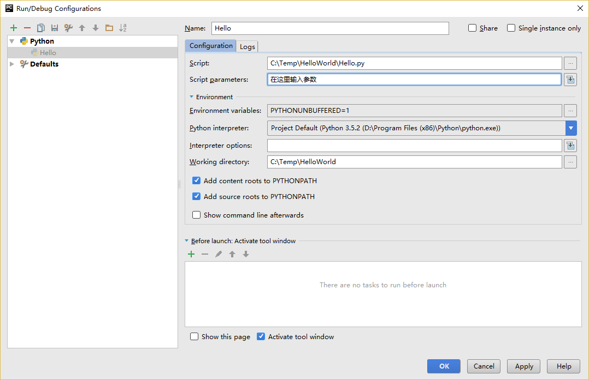

# 基礎

只是列印出 `hello world` 肯定是不夠的，是嗎？你會希望做得比這還要多——你想要輸入一些內容，操縱它，然後從中得到一些輸出出來的內容。我們可以在 Python 中通過使用變量與常量來實現這一目標，在本章中我們還會學習其他的一些概念。[^1]

## 注釋

_注釋_  是任何存在于 `#` 號右側的文字，其主要用作寫給程式讀者看的筆記。

舉個例子：

```python
print('hello world') #注意到 print 是一個函數
```

或者：

```python
# 注意到 print 是一個函數
print('hello world')
```

你應該在你的程式中盡可能多地使用有用的注釋：

- 解釋假設
- 說明重要的決定
- 解釋重要的細節
- 說明你想要解決的問題
- 說明你想要在程式中克服的問題，等等。

[*代碼會告訴你怎麼做，注釋會告訴你為何如此。*](http://www.codinghorror.com/blog/2006/12/code-tells-you-how-comments-tell-you-why.html)

這樣做對你的程式的讀者來說非常有用，他們可以很容易地理解你的程式是做什麼的。請記住，這個人可以是六個月後的你！

## 字面常量 

一個字面常量（Literal Constants）[^2]的例子是諸如 `5`、`1.23` 這樣的數字，或者是如 `這是一串文本` 或 `This is a string` 這樣的文本。

這麼稱呼這一變量是因為它們是 _字面上的_ [^3]——你用的就是它字面意義上的值或是內容。數字 `2` 總是表示它本身而非其他含義——它是一個 _常量_，因為它的值不能被改變。因此，所有的這些都被稱作字面常量。

## 數字

數字主要分為兩種類型——整數（Integers）與浮點數（Floats）。

有關整數的例子即 `2`，它只是一個整數。

有關浮點數（Floating Point Numbers，在英文中也會簡寫為 _floats_ ）的例子是 `3.23` 或 `52.3E-4`。其中，`E` 表示 10 的冪。在這里，`52.3E-4` 表示 `52.3 * 10^-4`。

> **針對有經驗的程式員的提示**
> 
> 沒有單獨的 `long` 類型。`int` 類型可以指任何大小的整數。

## 字串

一串字串（String）是 _字符（Characters）_ 的 _序列（Sequence）_。基本上，字串就是一串辭匯。

你將會在幾乎所有你撰寫的 Python 程式中使用字串，所以對下面的部分你要多上點心。

### 單引號

你可以使用單引號來指定字串，例如 `'將我這樣框進來'` 或 `'Quote me on this'` 。

所有引號內的空間，諸如空格與制表符，都將按原樣保留。

### 雙引號

被雙引號包括的字串和被單引號括起的字串其工作機制完全相同。例如 `"你的名字是？"` 或 `"What's your name?"` 。

### 三引號 {#triple-quotes}

你可以通過使用三個引號——`"""` 或 `'''` 來指定多行字串。你可以在三引號之間自由地使用單引號與雙引號。來看看這個例子：

```python
'''這是一段多行字串。這是它的第一行。
This is the second line.
"What's your name?," I asked.
He said "Bond, James Bond."
'''
```

### 字串是不可變的

這意味著一旦你創造了一串字串，你就不能再改變它。盡管這看起來像是一件壞事，但實際上並非如此。我們將會在稍後展現的多個程式中看到為何這一點不是一個限制。

> **針對 C/C++ 程式員的提示**
> 
> Python 中沒有單獨的 `char` 資料類型。它並非切實必要，並且我相信你不會想念它的。


<!-- -->

> **針對 Perl/PHP 程式員的提示**
> 
> 記住單引號括起的字串和雙引號括起的字串是一樣的——它們不存在任何區別。

### 格式化方法

有時候我們會想要從其他資訊中構建字串。這正是 `format()` 方法大有用武之地的地方。

將以下內容保存為文件 `str_format.py` ：

```python
age = 20
name = 'Swaroop'

print('{0} was {1} years old when he wrote this book'.format(name, age))
print('Why is {0} playing with that python?'.format(name))
```

輸出：

```
$ python str_format.py
Swaroop was 20 years old when he wrote this book
Why is Swaroop playing with that python?
```

**它是如何工作的**

一個字串可以使用某些特定的格式（Specification），隨後，`format` 方法將被調用，使用這一方法中與之相應的參數替換這些格式。

在這里要注意我們第一次應用這一方法的地方，此處 `{0}` 對應的是變量 `name`，它是該格式化方法中的第一個參數。與之類似，第二個格式 `{1}` 對應的是變量 `age`，它是格式化方法中的第二個參數。請注意，Python 從 0 開始計數，這意味著索引中的第一位是 0，第二位是 1，以此類推。

我們可以通過聯立字串來達到相同的效果：

```python
name + 'is' +str(age) + 'years old'
```

但這樣實現是很醜陋的，而且也容易出錯。其次，轉換至字串的工作將由 `format` 方法自動完成，而不是如這般需要明確轉換至字串。再次，當時用 `format` 方法時，我們可以直接改動文字而不必與變量打交道，反之亦然。

同時還應注意數字只是一個可選選項，所以你同樣可以寫成：

```python
age = 20
name = 'Swaroop'

print('{} was {} years old when he wrote this book'.format(name, age))
print('Why is {} playing with that python?'.format(name))
```

這樣做同樣能得到與前面的程式一樣的輸出結果。

Python 中 `format` 方法所做的事情便是將每個參數值替換至格式所在的位置。這之中可以有更詳細的格式，例如：

```python
# 對于浮點數 '0.333' 保留小數點(.)後三位
print('{0:.3f}'.format(1.0/3))
# 使用下劃線填充文本，並保持文字處于中間位置
# 使用 (^) 定義 '___hello___'字串長度為 11
print('{0:_^11}'.format('hello'))
# 基于關鍵字輸出 'Swaroop wrote A Byte of Python'  
print('{name} wrote {book}'.format(name='Swaroop', book='A Byte of Python'))
```

輸出：

```
0.333
___hello___
Swaroop wrote A Byte of Python
```

由于我們正在討論格式問題，就要注意 `print` 總是會以一個不可見的『新一行』字符（`\n`）結尾，因此重複調用 `print`將會在相互獨立的一行中分別列印。為防止列印過程中出現這一換行符，你可以通過 `end` 指定其應以空白結尾：

```python
print('a', end='')
print('b', end='')
```

輸出結果如下：

```
ab
```

或者你通過 `end` 指定以空格結尾：

```python
print('a', end=' ')
print('b', end=' ')
print('c')
```

輸出結果如下：

```
a b c
```

### 轉義序列

想象一下，如果你希望生成一串包含單引號（`'`）的字串，你應該如何指定這串字串？例如，你想要的字串是 `"What's your name?"`。你不能指定 `'What's your name?'`，因為這會使 Python 對于何處是字串的開始、何處又是結束而感到困惑。所以，你必須指定這個單引號不代表這串字串的結尾。這可以通過 _轉義序列（Escape Sequence）_ 來實現。你通過 `\` 來指定單引號：要注意它可是反斜杠。現在，你可以將字串指定為 `'What\'s your name?'`。

另一種指定這一特別的字串的方式是這樣的： `"What's your name?"` ，如這個例子般使用雙引號。類似地， 你必須在使用雙引號括起的字串中對字串內的雙引號使用轉義序列。同樣，你必須使用轉義序列 `\\` 來指定反斜杠本身。

如果你想指定一串雙行字串該怎麼辦？一種方式即使用[如前所述](#triple-quotes)的三引號字串，或者你可以使用一個表示新一行的轉義序列——`\n` 來表示新一行的開始。下面是一個例子：

```python
'This is the first line\nThis is the second line'
```

另一個你應該知道的大有用處的轉義序列是制表符：`\t` 。實際上還有很多的轉義序列，但我必須只在此展示最重要的一些。

還有一件需要的事情，在一個字串中，一個放置在末尾的反斜杠表示字串將在下一行繼續，但不會添加新的一行。來看看例子：

```python
"This is the first sentence. \
This is the second sentence."
```

相當于

```python
"This is the first sentence. This is the second sentence."
```

### 原始字串

如果你需要指定一些未經過特殊處理的字串，比如轉義序列，那麼你需要在字串前增加 `r` 或 `R` 來指定一個 _原始（Raw）_ 字串[^4]。下面是一個例子：

```python
r"Newlines are indicated by \n"
```

> **針對正則運算式用戶的提示**
> 
> 在處理正則運算式時應全程使用原始字串。否則，將會有大量 Backwhacking 需要處理。舉例說明的話，反向引用可以通過 `'\\1'` 或 `r'\1' ` 來實現。

## 變量

如果只使用字面常量很快就會讓人感到無聊——我們需要一些能夠存儲任何資訊並且也能操縱它們的方式。這便是 _變量（Veriables）_ 登場的時刻。正如其名字所述那般，變量的值是可以變化的，也就是說，你可以用變量來存儲任何東西。變量只是你的電腦記憶體中用以存儲資訊的一部分。與文字常量不同，你需要通過一些方式來訪問這些變量，因此，你需要為它們命名。

## 識別字命名

變量是識別字的一個例子。_識別字（Identifiers）_ 是為 _某些東西_ 提供的給定名稱。在你命名識別字時，你需要遵守以下規則：

- 第一個字符必須是字母表中的字母（大寫 ASCII 字符或小寫 ASCII 字符或 Unicode 字符）或下劃線（`_`）。
- 識別字的其他部分可以由字符（大寫 ASCII 字符或小寫 ASCII 字符或 Unicode 字符）、下劃線（`_`）、數字（0~9）組成。
- 識別字名稱區分大小寫。例如，`myname` 和 `myName` 並_不_等同。要注意到前者是小寫字母 `n` 而後者是大寫字母 `N`。
- _有效_ 的識別字名稱可以是 `i` 或 `name_2_3` ，_無效_ 的識別字名稱可能是 `2things`，`this is spaced out`，`my-name` 和 `>a1b2_c3`。

## 資料類型

變量可以將各種形式的值保存為不同的_資料類型（Data Type）_。基本的類型是我們已經討論過的數字與字串。在後面的章節中，我們會了解如何通過 [類（Classes）](./14.oop.md#classes) 類創建我們自己的類型。

## 物件

需要記住的是，Python 將程式中的任何內容統稱為 _物件（Object）_。這是一般意義上的說法。我們以『_某某物件（object）_』相稱，而非『_某某東西（something）_』。

> **針對面向物件編程語言用戶的提示：**
> 
> Python 是強（Strongly）面向物件的，因為所有的一切都是物件， 包括數字、字串與函數。

接下來我們將看見如何使用變量與字面常量。你需要保存以下案例並試圖運行程式。

## 如何編寫 Python 程式

從今以後，保存和運行 Python 程式的標准步驟如下：

### 對于 PyCharm 用戶

1. 打開 [PyCharm](./06.first_steps.md#pycharm)。
2. 以給定的文件名創建新文件。
3. 輸入案例中給出的代碼。
4. 右鍵並運行當前文件。

注意：每當你需要提供 [命令行參數（Command Line Arguments）](./11.modules.md#modules)時，點擊 `Run` -> `Edit Configurations` 並在 `Script parameters:` 部分輸入相應參數，並點擊 `OK` 按鈕：



### 對于其他編輯器用戶

1. 打開你選擇的編輯器。
2. 輸入案例中給出的代碼。
3. 以給定的文件名將其保存成文件。
4. 在解釋器中通過命令 `python program.py` 來運行程式。

### 案例：使用變量與字面常量

輸入並運行以下程式：

```python
# 文件名：var.py
i = 5
print(i)
i = i + 1
print(i)

s = '''This is a multi-line string.
This is the second line.'''
print(s)
```

輸出：

```
5
6
This is a multi-line string.
This is the second line.
```

**它是如何工作的**

下面是這一程式的工作原理。首先，我們使用賦值運算符（`=`）將字面常量數值 `5` 賦值給變量 `i`。這一行被稱之為聲明語句（Statement）因為其工作正是聲明一些在這一情況下應當完成的事情：我們將變量名 `i` 與值 `5` 相連接。然後，我們通過 `print` 語句來列印變量 `i` 所聲明的內容，這並不奇怪，只是將變量的值列印到螢幕上。

接著，我們將 `1` 加到 `i` 變量所存儲的值中，並將得出的結果重新存儲進這一變量。爾後我們將這一變量列印出來，並期望得到的值應為 `6`。

類似地，我們將字面文本賦值給變量 `s`，並將其列印出來。

> **針對靜態編程語言程式員的提示**
> 
> 變量只需被賦予某一值。不需要聲明或定義資料類型。

## 邏輯行與物理行

所謂物理行（Physical Line）是你在編寫程式時 _你所看到_ 的內容。所謂邏輯行（Logical Line）是 _Python 所看到_ 的單個語句。Python 會假定每一 _物理行_ 會對應一個 _邏輯行_。

有關邏輯行的一個例子是諸如 `print('hello world')` 這樣一句語句——如果其本身是一行（正如你在編輯器里所看到的那樣），那麼它也對應著一行物理行。

Python 之中暗含這樣一種期望：Python 鼓勵每一行使用一句獨立語句從而使得代碼更加可讀。

如果你希望在一行物理行中指定多行邏輯行，那麼你必須通過使用分號(`;`)來明確表明邏輯行或語句的結束。下面是一個例子：

```python
i = 5
print(i)
```

實際上等同于

```python
i = 5;
print(i);
```

同樣可以看作

```python
i = 5; print(i);
```

也與這一寫法相同

```python
i = 5; print(i)
```

然而，我*強烈建議*你**對于每一行物理行最多只寫入一行邏輯行**。這個觀點就是說你不應該使用分號。實際上，我_從未_在 Python 程式中使用、甚至是見過一個分號。

在一類情況下這一方法會頗為有用：如果你有一行非常長的代碼，你可以通過使用反斜杠將其拆分成多個物理行。這被稱作_顯式行連接（Explicit Line Joining）_[^5]：

```python
s = 'This is a string. \
This continues the string.'
print(s)
```

輸出：

```
This is a string. This continues the string.
```

類似地，

```python
i = \
5
```

等同于

```python
i = 5
```

在某些情況下，會存在一個隱含的假設，允許你不使用反斜杠。這一情況即邏輯行以括弧開始，它可以是方括弧或花括弧，但不能是結束括弧。這被稱作 *隱式行連接（Implicit Line Joining）*。你可以在後面當我們討論[列表（List）](./12.data_structures.md#lists)的章節時了解這一點。

## 縮進

空白區[^6]在 Python 中十分重要。實際上，*空白區在各行的開頭非常重要*。這被稱作 _縮進（Indentation）_。在邏輯行的開頭留下空白區（使用空格或制表符）用以確定各邏輯行的縮進級別，而後者又可用于確定語句的分組。

這意味著放置在一起的語句_必須_擁有相同的縮進。每一組這樣的語句被稱為 *塊（block）*。我們將會在後文章節的案例中了解塊這一概念是多麼重要。

有一件事你需要記住：錯誤的縮進可能會導致錯誤。下面是一個例子：

```python
i = 5
# 下面將發生錯誤，注意行首有一個空格
 print('Value is', i)
print('I repeat, the value is', i)
```

當你運行這一程式時，你將得到如下錯誤：

```
  File "whitespace.py", line 3
    print('Value is', i)
    ^
IndentationError: unexpected indent
# 縮進錯誤：意外縮進
```

你會注意到第二行開頭有一個空格。Python 指出的錯誤資訊告訴我們程式的語法是無效的，意即，程式沒有被正確地寫入。這一資訊對你的意義是 _你不能任意開始一個新的語句塊_（當然，除非你一直在使用默認的主代碼塊）。你可以使用新塊的情況將會在後面諸如[控制流](./09.control_flow.md#control_flow)等章節加以介紹。

> **如何縮進**
> 
> 使用四個空格來縮進。這是來自 Python 語言官方的建議。好的編輯器會自動為你完成這一工作。請確保你在縮進中使用數量一致的空格，否則你的程式將不會運行，或引發不期望的行為。

<!-- -->

> **針對靜態編程語言程式員的提示**
> 
> Python 將始終對塊使用縮進，並且絕不會使用大括弧。你可以通過運行 `from __future__ import braces` 來了解更多資訊。

## 總結

現在我們已經了解了諸多本質性的細節，我們可以前去了解控制流語句等更多更加有趣的東西。記得一定要充分理解你在本章所閱讀的內容。


---

[^1]: 自本章起，書中將出現大量程式源代碼內容，在源代碼中會包含一些英文語句或者英文注釋。為保持源代碼整體美觀以及避免其他不必要的改動，在代碼內容中出現的英文語句將會保持原樣，英文注釋將酌情翻譯。

[^2]: 『字面常量』原文作 Literal Constants。沈潔元譯本譯作『字面意義上的常量』。在一些 Python 中文文檔中，Literal 譯作『字面值』。

[^3]: 原文作 literal。

[^4]: 『原始字串』原文作 Raw String。沈潔元譯本譯作『自然字串』。

[^5]: 沈潔元譯本譯作『明確的行連接』。

[^6]: 空白區原文作『Whitespace』，沈潔元譯本譯作『空白』。它可能被理解成『空格』，但為了與後文的空格（Space）區分，此處取字面意。
